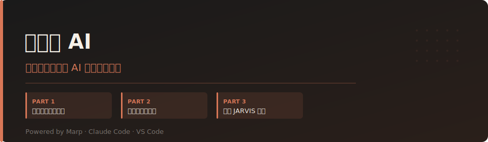

# 好好用 AI

---

## Opening

這套課程為企業內訓設計, 適合每天用電腦工作, 但從未寫過程式的人

"倚天屠龍記" 中, 張無忌初學太極時, 張三豐告訴他: 忘掉招式.

真正的太極, 不是記住每一招、每一式, 而是在千錘百鍊之後, 將所有招式內化為本能; 不拘泥於形式, 不執著於套路, 因時制宜, 隨勢而動, 以柔克剛.

AI 也是如此.

今天課堂上介紹的, 甚至未來還會出現更多新的工具與名詞, 它們都只是 "招式".

真正重要的, 不是背會每一個工具, 不是記住每一個 Prompt, 而是培養一種能力:

當面對新的工作, 新的問題, 新的 AI 時, 你能自然地思考:

- 我真正要解決的是什麼問題?
- 哪些事情應該交給 AI?
- 哪些判斷必須由人負責?
- 如何驗證 AI 的結果?
- 如何讓 AI 成為自己的能力延伸, 而不是思考的替代品?

當這些思考已經成為你的習慣, 你就不再需要依賴任何一套固定的方法.

因為你學會的, 不是 AI 的招式, 而是 AI 的心法.

具備駕馭未來任何 AI 的能力.